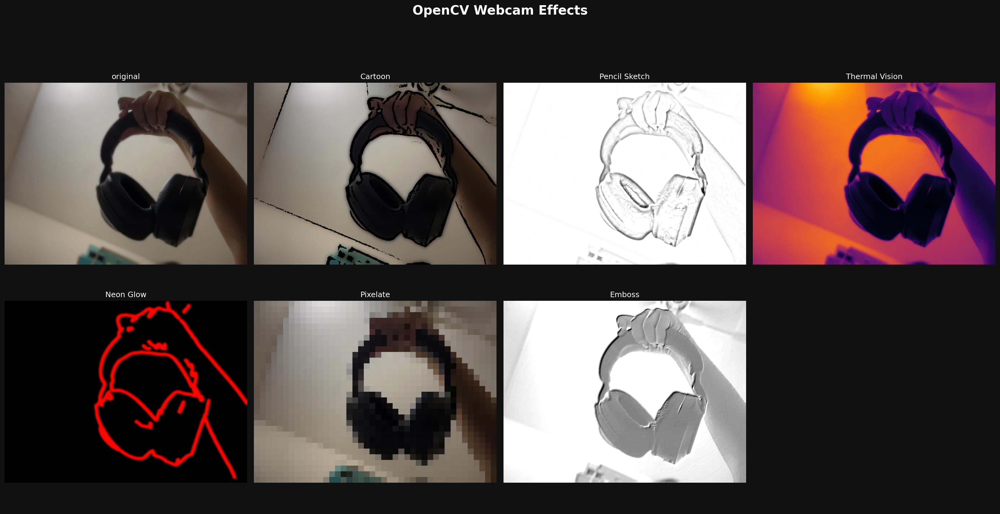

# OpenCV Webcam Artistic Effects Widget 📸🎨

An interactive computer vision project built for **Google Colab** that captures live webcam frames and applies six distinct, stylized artistic filters using **OpenCV** and **NumPy**. 

##  Features
* **Interactive Webcam Interface:** Seamless browser-to-python capture engine using custom JavaScript integration.
* **6 Creative Vision Filters:**
  * **Cartoon:** Smooth skin textures combined with sharp, adaptive-threshold edge lines.
  * **Pencil Sketch:** Grayscale blending simulation replicating hand-drawn pencil art.
  * **Thermal Vision:** Deep intensity heat mapping utilizing the `INFERNO` color space.
  * **Neon Glow:** Edge tracing with distance transforms for a vibrant retro-neon aura.
  * **Pixelate:** Block-resampling pipelines for a low-res, retro video game aesthetic.
  * **Emboss:** Directional convolution kernel mapping to produce a 3D stamped metal look.
* **Collage Generator:** Beautiful, dark-themed 2x4 image matrix export matching professional presentation layouts.

## Preview
Here is a snapshot of the generated collage grid:



## How to Run

### Option 1: Quick Run in Google Colab (Recommended)
1. Download the `opencv_webcam_effects.ipynb` file from this repository.
2. Go to [Google Colab](https://google.com).
3. Click **File > Upload Notebook** and select the downloaded file.
4. Run the cells sequentially. Click the green **"Capture Photo"** button when the webcam UI initializes!

### Option 2: Local Installation (For Notebook Environments)
If running inside a local Jupyter environment, ensure you have the required dependencies:

```bash
pip install opencv-python numpy matplotlib
```

##  Built With
* [OpenCV](https://opencv.org) - Computer Vision Framework
* [NumPy](https://numpy.org) - Multidimensional Array Computations
* [Matplotlib](https://matplotlib.org) - Grid Plotting and Visual Layouts
